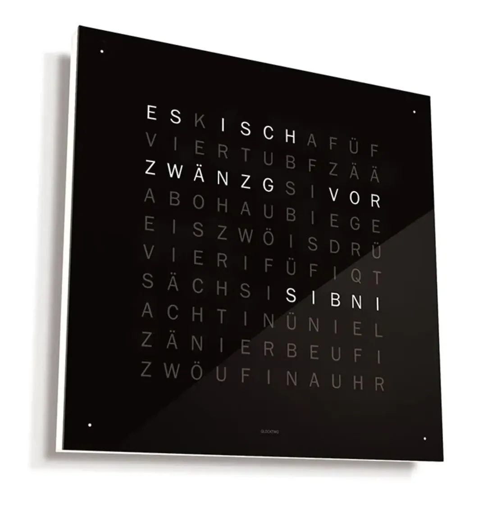

# Bärner Wort-Uhr

A QLOCKTWO-inspired word clock displaying time in Bernese German (Bärndütsch) on a 64x64 RGB LED matrix.



## Features

- Displays time as words in 5-minute intervals (e.g., "ES ISCH VIERT VOR SIBNI")
- Four corner dots indicate exact minutes within each interval
- Built-in 5x5 pixel font with German umlaut support (Ä, Ö, Ü)
- Configurable colors and brightness
- Simulation mode for testing without hardware

## Hardware

- **LED Panel**: 64x64 RGB LED Matrix (HUB75 interface, 1/32 scan)
- **Controller**: Raspberry Pi (tested on Pi 1 Model B)
- **Tested Panel**: [Seengreat RGB Matrix P3.0 64x64](https://seengreat.com/wiki/74/rgb-matrix-p3-0-64x64)

## Installation

### On Raspberry Pi

```bash
# Install the rpi-rgb-led-matrix library
sudo ./install.sh

# Or manually:
sudo apt-get install -y git python3-dev
git clone https://github.com/hzeller/rpi-rgb-led-matrix.git /opt/rpi-rgb-led-matrix
cd /opt/rpi-rgb-led-matrix
make
cd bindings/python
sudo make build-python install-python
```

## Usage

```bash
# Run the clock (requires sudo for GPIO access)
sudo python3 clock.py

# Simulation mode (no hardware needed)
python3 clock.py --simulate

# With options
sudo python3 clock.py --brightness 60 --color warm --dim-brightness 30
```

### Command Line Options

| Option | Default | Description |
|--------|---------|-------------|
| `--color`, `-c` | white | Letter color: white, warm, cool, red, green, blue, orange, yellow, or #RRGGBB |
| `--brightness`, `-b` | 50 | Display brightness (1-100) |
| `--dim-brightness` | 40 | Brightness of unlit letters (0-255, 0 = hidden) |
| `--simulate`, `-s` | - | Run in simulation mode |
| `--led-gpio-mapping` | regular | GPIO mapping: regular, adafruit-hat, adafruit-hat-pwm |
| `--led-slowdown-gpio` | 1 | GPIO slowdown (0-4; use 0-1 for Pi 1, 4 for Pi 4) |

## Word Grid

```
E S K I S C H A F Ü F
V I E R T U B F Z Ä Ä
Z W Ä N Z G S I V O R
A B O H A U B I E G E
E I S Z W Ö I S D R Ü
V I E R I F Ü F I Q T
S Ä C H S I S I B N I
A C H T I N Ü N I E L
Z Ä N I E R B Ö U F I
Z W Ö U F I N A U H R
```

## Time Display Examples

| Time | Display |
|------|---------|
| 7:00 | ES ISCH SIBNI UHR |
| 7:05 | ES ISCH FÜF AB SIBNI |
| 7:15 | ES ISCH VIERT AB SIBNI |
| 7:25 | ES ISCH FÜF VOR HAUBI ACHTI |
| 7:30 | ES ISCH HAUBI ACHTI |
| 7:45 | ES ISCH VIERT VOR ACHTI |

Corner dots (●) show minutes within each 5-minute interval:
- 7:00 → no dots
- 7:01 → ● (1 dot)
- 7:02 → ●● (2 dots)
- 7:03 → ●●● (3 dots)
- 7:04 → ●●●● (4 dots)

## Testing

```bash
# Run unit tests
python3 test_clock.py

# Visual demo of all time intervals
python3 test_clock.py --demo
```

## License

MIT
